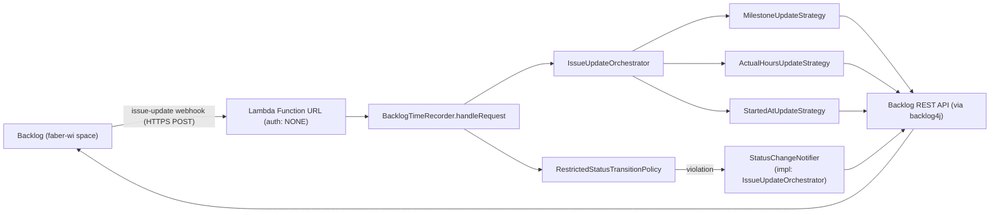
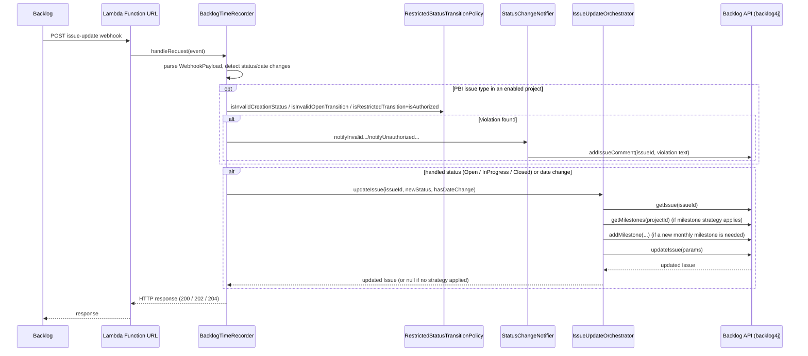

# System Architecture

## Overview

Backlog Time Recorder is a single AWS Lambda function, deployed via AWS CDK,
that reacts to Backlog issue-update webhooks and keeps milestone,
actual-hours, and "Started at" data in sync on the issue.

It also runs an independent, opt-in check that flags (via a Backlog issue
comment, never a revert) unwanted status transitions or creation statuses on
"PBI"-type issues, once configured for a project.

**Architecture Style**: Serverless, event-driven (single-function webhook receiver)

**Last Updated**: 2026-09-07

## System Context

### Purpose

The service removes manual maintenance of monthly milestones, actual hours,
and a "Started at" custom field on Backlog issues. It integrates with the
Backlog REST API (via [backlog4j](https://github.com/nulab/backlog4j)) for
the `faber-wi` space.

### Key Requirements

**Functional Requirements**:

- Receive Backlog issue-update webhook events over HTTPS.
- Recompute and apply monthly milestones when an issue's start/due date changes.
- Calculate and set actual hours when an issue is closed and none is recorded yet.
- Stamp/update the "Started at" custom field when an issue moves to Open or In Progress.
- For "PBI"-type issues in an enabled project, flag (via an issue comment) a status
  change or creation status that violates the Product-Owner-only transition rules.

**Non-Functional Requirements**:

| Category | Requirement | Source |
| -------- | ----------- | ------ |
| Timeout | 30 seconds per invocation | `Duration.seconds(30)` in [BacklogTimeRecorderStack.java](../../src/main/java/com/myorg/BacklogTimeRecorderStack.java) |
| Cold start | SnapStart enabled | `SnapStartConf.ON_PUBLISHED_VERSIONS` in the same stack |
| Log retention | 1 month | `RetentionDays.ONE_MONTH` in the same stack |

No explicit SLA, throughput, or availability target is documented beyond
what AWS Lambda provides by default (TODO if the team wants explicit
targets).

## High-Level Architecture

### Architecture Diagram

### Component Overview

| Component | Purpose | Technology |
| --------- | ------- | ---------- |
| `BacklogTimeRecorderStack` (CDK) | Provisions the Lambda function and its Function URL | AWS CDK (Java) |
| `BacklogTimeRecorder` (handler) | Entry point invoked per webhook call; decides whether/how to react | Java 17, `aws-lambda-java-core` |
| `IssueUpdateOrchestrator` | Fetches the issue, runs the update strategies, persists changes; also implements `StatusChangeNotifier` | Java 17, backlog4j |
| `UpdateStrategy` implementations | One self-contained update rule each (milestone / actual hours / started-at) | Java 17 |
| `RestrictedStatusTransitionPolicy` | Opt-in PBI status-transition/creation rules, built from env vars | Java 17 (pure logic, no Backlog API) |
| `StatusChangeNotifier` | Posts a Backlog issue comment for a flagged status violation | Java 17, backlog4j |

## Core Components

### BacklogTimeRecorder (handler)

**Purpose**: Entry point invoked by the Lambda Function URL for every Backlog webhook call.

**Responsibilities**:

- Decode the (possibly base64-encoded) request body into a `WebhookPayload`.
- Determine whether the issue's status changed to a handled status (Open,
  In Progress, Closed) or its start/due date changed.
- Delegate to `IssueUpdateOrchestrator` when applicable; otherwise return
  early with a 204.

**Technology**: Java 17, implements
`RequestHandler<APIGatewayV2HTTPEvent, APIGatewayV2HTTPResponse>`.

**Key Dependencies**: `IssueUpdater` (implemented by `IssueUpdateOrchestrator`),
backlog4j's `StatusType` enum.

**Interface**: invoked over the Lambda Function URL — there is no separate REST API.

### IssueUpdateOrchestrator

**Purpose**: Runs the update strategies against a freshly-fetched Backlog issue.

**Responsibilities**:

- Fetch the current issue and, if needed, its project's milestones from Backlog.
- Run each `UpdateStrategy`'s `canApply` / `apply`.
- Persist all applicable changes via a single `updateIssue` call.

**Technology**: Java 17, backlog4j `BacklogClient`.

**Key Dependencies**: `MilestoneHelper`, `TimeTrackingHelper`, `WorkScheduleHelper`.

### Update Strategies

- **MilestoneUpdateStrategy** — recalculates the set of monthly milestones
  that should cover the issue's start–due range: keeps milestones still in
  range, creates missing ones (via `ProjectContext.getOrCreateMilestone`),
  and drops ones no longer needed.
- **ActualHoursUpdateStrategy** — on close, if no actual hours are recorded
  yet, computes them from the issue's creation date and its "Started at"
  custom field (bounded to 0–999 hours; out-of-range results are dropped).
- **StartedAtUpdateStrategy** — on Open/In Progress, stamps or updates the
  "Started at" custom field via `TimeTrackingHelper.formatStartedAt`.

### PBI Status Validation

**Purpose**: Flag (never revert) status transitions or creation statuses on
"PBI"-type issues that bypass Product-Owner-only rules.

**Responsibilities**:

- `RestrictedStatusTransitionPolicy` — built via `fromEnv()` from
  `PRODUCT_OWNER_USER_IDS`, `SETTING_PRIORITY_STATUS_IDS`, and
  `ENABLED_PROJECT_KEYS` (all optional; the whole feature is disabled unless
  all three are set for a given project). Decides: is this project/issue
  type in scope; is a transition to Setting Priority/Closed restricted to
  Product Owners; is a transition out of Open invalid; is a creation status
  other than Open invalid.
- `StatusChangeNotifier` (implemented by `IssueUpdateOrchestrator`) — posts a
  Backlog issue comment describing the violation and notifying a single
  hardcoded reviewer user ID (`STATUS_VIOLATION_NOTIFY_USER_ID`).
- `BacklogTimeRecorder.handleRequest` computes the enablement gate inside a
  `try/catch (RuntimeException)`, so a malformed env var (e.g. a non-numeric
  ID) only disables the check for that invocation instead of failing the
  whole webhook.

**Technology**: Java 17. `RestrictedStatusTransitionPolicy` has no Backlog
API dependency; `StatusChangeNotifier`'s implementation uses backlog4j's
`addIssueComment`.

**Key Dependencies**: `Activity.Type` (backlog4j) to distinguish issue
creation from a status-change webhook.

## Communication Patterns

### Synchronous Communication

- **Backlog → Lambda**: HTTPS POST to the Lambda Function URL
  (`FunctionUrlAuthType.NONE` — publicly reachable, with no authentication at
  the transport level).
- **Lambda → Backlog**: HTTPS calls via backlog4j's `BacklogClient` to the
  `faber-wi` space, authenticated on each call with `BACKLOG_API_KEY`.

No message queues, event buses, or other asynchronous communication is used.

## Data Architecture

There is no dedicated data store for this service — Backlog itself is the
system of record. The Lambda is stateless: it reads the current issue and
milestone state from the Backlog API and writes updates back on every
invocation, with no local persistence or caching.

### Request Flow

## Security Architecture

### Authentication & Authorization

- **Backlog → Lambda**: none — the Function URL's auth type is `NONE`.
  The endpoint relies on the URL being unguessable rather than a verified
  signature from Backlog. TODO: consider verifying a shared secret or
  signature on inbound requests if this is a concern.
- **Lambda → Backlog**: a single `BACKLOG_API_KEY`, injected into the
  Lambda's environment by the CDK stack from the `BACKLOG_API_KEY`
  environment variable at deploy time (see
  [Deployment Guide](../guides/deployment.md)).
- **PBI status validation authorization**: not enforced by Backlog itself —
  `RestrictedStatusTransitionPolicy.isAuthorized` only checks the webhook's
  `createdUser` ID against `PRODUCT_OWNER_USER_IDS`, a CSV env var. A
  violation is flagged with an issue comment, not blocked or reverted, so
  this is a detective control, not a preventive one. The three env vars
  (`PRODUCT_OWNER_USER_IDS`, `SETTING_PRIORITY_STATUS_IDS`,
  `ENABLED_PROJECT_KEYS`) are injected the same way as `BACKLOG_API_KEY`,
  and the whole check stays disabled until all three are set for a project.

### Data Security

- **Encryption in transit**: HTTPS, for both the Function URL and the
  Backlog API.
- **Encryption at rest**: not applicable — the Lambda holds no persistent
  data of its own.

## Scalability & Performance

- Lambda scales automatically with concurrent webhook invocations (default
  AWS Lambda behavior); no custom concurrency configuration is set in the
  CDK stack.
- SnapStart (`SnapStartConf.ON_PUBLISHED_VERSIONS`) reduces Java cold-start
  latency.
- Invocation timeout is 30 seconds.

No load or performance targets are currently defined (TODO).

## Reliability & Availability

- Single Lambda function, single AWS region (`ap-northeast-1`, per
  [.github/workflows/deploy.yml](../../.github/workflows/deploy.yml)); no
  documented multi-region or disaster-recovery strategy (TODO).
- If applying a milestone update for a date-change event throws, the handler
  logs the error at `ERROR` level and still returns a success-range response
  rather than retrying — see the `catch` block in
  [`BacklogTimeRecorder.handleRequest`](../../lambda/src/main/java/com/lambda/handlers/BacklogTimeRecorder.java).
  Backlog will not see a webhook delivery failure in that case.

## Monitoring & Observability

- **Logging**: AWS Lambda / CloudWatch Logs, retained for 1 month
  (`RetentionDays.ONE_MONTH`). The handler logs the raw webhook body at
  `DEBUG` and update failures at `ERROR`.
- No custom metrics, distributed tracing, or alerting is currently
  configured (TODO).

## Deployment Architecture

Deployed via GitHub Actions on every push to `master` — see the
[Deployment Guide](../guides/deployment.md) for the full pipeline. There is a
single environment; no separate dev/staging/production stacks are defined in
this repo.

## Technology Stack

See the [root README](../../README.md#tech-stack) for the current
technology table (Java 17, AWS CDK 2.114.0, backlog4j 2.6.0, AWS Lambda).

## Architecture Decisions

No ADRs have been recorded yet for this project. See `docs/ADR/` once it exists.

## Constraints & Trade-offs

| Decision | Benefit | Drawback |
| -------- | ------- | -------- |
| Function URL with `authType: NONE` | Simple, no API Gateway to manage | Anyone with the URL can POST to it; no verified caller identity |
| No caching; re-fetch issue/milestones every call | Always consistent with current Backlog state | Extra Backlog API calls per webhook invocation |
| Errors from milestone updates are logged, not retried | Keeps the handler simple and fast | Failures during a date-change update are silent to Backlog and only visible in CloudWatch Logs |
| PBI status violations are flagged via comment, not reverted or blocked | Simple to implement; no risk of the Lambda fighting a legitimate override | A flagged issue stays in its (possibly wrong) status until a human acts on the comment |

## Future Considerations

### Known Limitations

- No webhook signature/secret verification on inbound requests.
- No automated tests for the CDK stack beyond the default synth-level test
  (`BacklogTimeRecorderTest`).
- Milestone-update failures during a date-change event are logged but not
  retried or surfaced anywhere else.
- `STATUS_VIOLATION_NOTIFY_USER_ID` (the reviewer notified on a PBI status
  violation) is a single hardcoded Backlog user ID, not configurable via env
  var.
- PBI status validation trusts the webhook's `createdUser` field as the
  actor; it does not re-verify against Backlog's own audit/activity log.

## References

- [Deployment Guide](../guides/deployment.md)
- [Project Overview](../overview/README.md)
