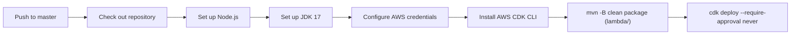

# Deployment Guide

## Overview

Backlog Time Recorder has a single deployment pipeline and a single AWS
environment — there is no separate dev/staging/production split defined in
this repo. Every push to `master` triggers an automatic deploy via GitHub
Actions.

## Prerequisites

- [ ] AWS credentials with permission to deploy the Lambda stack, stored as
      the `AWS_ACCESS_KEY_ID` / `AWS_SECRET_ACCESS_KEY` repository secrets
      used by [.github/workflows/deploy.yml](../../.github/workflows/deploy.yml)
- [ ] `BACKLOG_API_KEY` stored as a repository secret
- [ ] Code merged to `master` (or, for a manual local deploy, the CDK CLI
      and AWS credentials on your machine)

## Environments

| Environment | Purpose | Deploy Trigger |
| ----------- | ------- | --------------- |
| Production (only environment) | Live Backlog webhook receiver | push to `master` |

There is currently no dev/staging environment or manual approval gate —
every merge to `master` deploys straight to the only AWS environment this
stack targets. TODO: introduce a staging environment or manual approval step
if that becomes necessary.

## CI/CD Pipeline

Deployment is fully automated by
[.github/workflows/deploy.yml](../../.github/workflows/deploy.yml), triggered
on `push` to `master`:

1. Check out the repository
2. Set up Node.js (`lts/*`) — needed to install the CDK CLI
3. Set up JDK 17 (Microsoft distribution, with Maven caching)
4. Configure AWS credentials from the `AWS_ACCESS_KEY_ID` /
   `AWS_SECRET_ACCESS_KEY` secrets, region `ap-northeast-1`
5. Install the AWS CDK CLI (`npm install -g aws-cdk`)
6. Build the Lambda module: `mvn -B clean package` (in `lambda/`), with
   `BACKLOG_API_KEY` in the environment
7. Deploy: `cdk deploy --require-approval never`, with `BACKLOG_API_KEY` in
   the environment



## Manual Deployment

To deploy from your own machine:

```bash
export BACKLOG_API_KEY=your-backlog-api-key
cd lambda && mvn -B clean package && cd ..
cdk deploy --require-approval never
```

This requires local AWS credentials with permission to deploy the
`BacklogTimeRecorderStack`.

## Rollback Procedures

There is no scripted rollback in this repo. To roll back:

```bash
git checkout <previous-good-commit>
cd lambda && mvn -B clean package && cd ..
cdk deploy --require-approval never
```

Or revert the offending commit on `master` and let the normal CI pipeline
redeploy it. TODO: document a faster rollback path (e.g. re-pointing the
Lambda alias at a previous published version) if this becomes a real need.

## Verification

After a deploy:

- [ ] Check the GitHub Actions run for "Deploy Backlog Time Recorder" completed successfully
- [ ] Confirm the Lambda's Function URL is reachable (`aws lambda get-function-url-config --function-name <name>` or via the AWS Console)
- [ ] Trigger a real Backlog issue update in the `faber-wi` space and confirm the milestone / actual-hours / started-at logic fired as expected (check CloudWatch Logs for the function; 1-month retention)

There is no automated smoke test or health-check endpoint for this Lambda
(TODO if desired).

## Troubleshooting

### Issue: Deploy step fails on `cdk deploy`

Check the GitHub Actions run logs for the deploy step. Common causes:
missing/expired AWS credentials secrets, or a CDK synth error — try
`cdk synth` locally first.

### Issue: Lambda deployed but webhook calls fail

Check CloudWatch Logs for the `BacklogTimeRecorder` function. A
`BACKLOG_API_KEY is not set` error means the secret wasn't available during
deploy — verify the `BACKLOG_API_KEY` repository secret is configured.

## FAQ

### Can I deploy a feature branch?

Not via CI — the workflow only triggers on push to `master`. To try a
branch's changes in AWS, deploy manually from that branch using the manual
deployment steps above.

### How long does a deploy take?

Not currently measured; expect roughly the time to build the Lambda jar plus
a CDK deploy of a single Lambda function (typically a few minutes).
